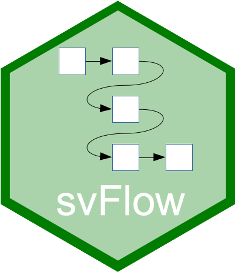

# svFlow - Workflow management and alternate pipe operator <a href='https://www.sciviews.org/svFlow'></a>

<!-- badges: start -->

[](https://github.com/SciViews/svFlow/actions/workflows/R-CMD-check.yaml) [](https://codecov.io/github/SciViews/svFlow?branch=master) [](https://cran.r-project.org/package=svFlow) [](https://opensource.org/licenses/MIT)

<!-- badges: end -->

{svFlow} manages pipeline workflow through a simple pipe operator `%>.%` that, on the contrary to base R pipe operator `|>` and {magrittr} operator `%>%` imposes to *always* specify where left-hand side of the operator should be injected in the right-hand side expression with a `.`. This conveys more clearly the intentions of the programmer and it is less error-prone.

Another pipe operator `%>_%` is more complex. It uses {proto} objects to embed several variables in the pipeline in a way that trhe non-standard evaluation (tidyverse's "lazyeval") is done in an easy and natural way.

## Installation

### Latest stable version

The latest stable version of {svFlow} can simply be installed from [CRAN](http://cran.r-project.org):

``` r
install.packages('svFlow')
```

### Development version

Make sure you have the {remotes} R package installed:

``` r
install.packages('remotes')
```

Use `install_github()` to install the {svFlow} package from Github (source from **master** branch will be recompiled on your machine):

``` r
remotes::install_github("SciViews/svFlow", build_vignettes = TRUE)
```

R should install all required dependencies automatically, and then it should compile and install {svFlow}.

## Usage

Make the {svFlow} package available in your R session:

``` r
library('svFlow')
```

Get help about this package:

``` r
library(help = 'svFlow')
help("flow-package")
```

For further instructions, please, refer to these help pages.

## Note to developers

Please note that this project is released with a [Contributor Code of Conduct](CONDUCT.md). By participating in this project you agree to abide by its terms.
